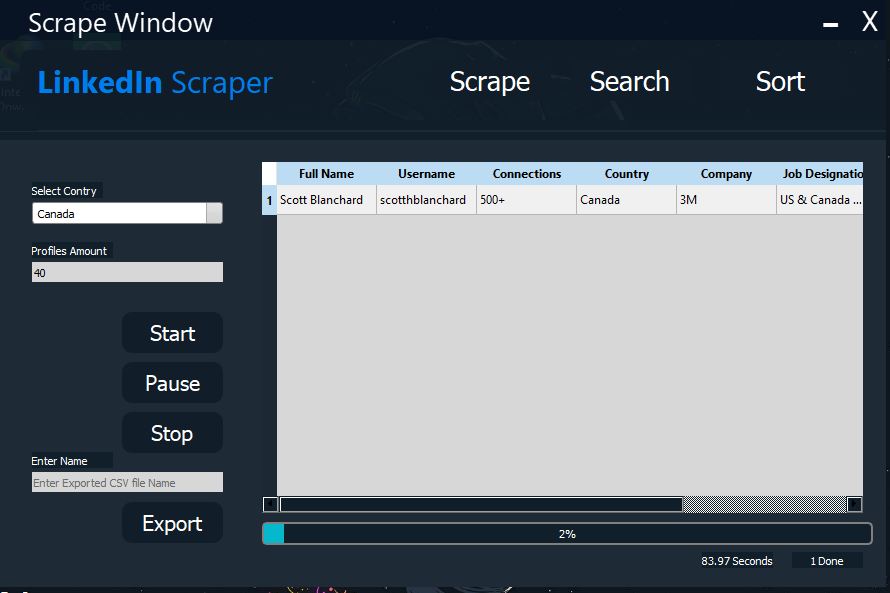

<h1 align="center">LinkedIn Profile Scrapper</h1>
<a href="#">
  

    
    <h2>This is the main screen of the program.</h2>
  

</a> 

# What is in this Project
- Scrape the linkedIn Profile of the users!
- Perform Sorting Operations on the huge data.
- Perform Searching Opeartions on the huge data.
- GUI is made on **QT Designer**.

## Sorting Algorithms
The sorting algorithms thaat are implemented in this program are listed below:
- Selection Sort
- Insertion Sort
- Merge Sort
- Bubble Sort
- Quick Sort
- Tim Sort
- Shell Sort
- Cock Tail Sort
- Comb Sort

## Searching Algorithms
The searching algorithms thaat are implemented in this program are listed below:
- Linear searching single column
- Linear searching multi column (A bit buggy)

## Author:
#### Muhammad Nouman Butt
You can get in touch with me on my LinkedIn Profile:

[ Muhammad Nouman Butt](https://www.linkedin.com/in/nouman0x45/)
[ Muhammad Nouman Butt](https://github.com/Nouman0x45)

If you liked the repo then kindly support it by giving it a star ⭐!

If you find any bug in the code or have any improvements in mind then feel free to generate a pull request.

If you face any issue, you can create a new issue in the Issues Tab and I will be glad to help you out.
